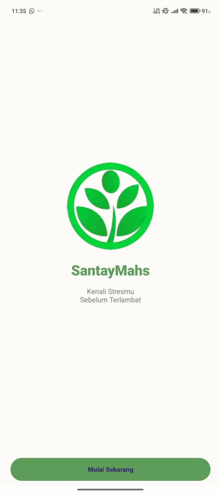
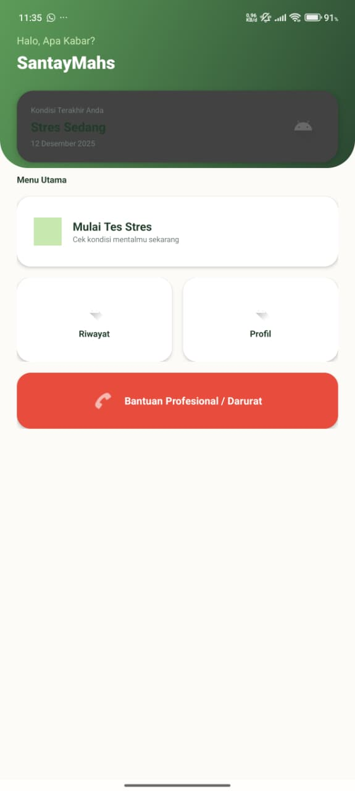

  
  
  # 🌿 SantayMahs - Student Mental Health Monitor

> **Platform digital yang membantu mahasiswa mendeteksi tingkat stres akademik secara dini, memonitor kesehatan mental, dan menghubungkan dengan bantuan profesional saat dibutuhkan.**

  
  
  
  
  

---

## 📋 Tentang Proyek

**SantayMahs** bukan sekadar aplikasi pencatat, melainkan asisten pribadi yang membantu mahasiswa mendeteksi tingkat stres akademik secara dini. Aplikasi ini dibuat sebagai pemenuhan **Tugas Akhir Mata Kuliah Pemrograman Sistem Bergerak** di Universitas Negeri Padang.

| Informasi Akademik | Detail |
| :--- | :--- |
| **Dosen Pengampu** | **Iip Permana, S.T., M.Kom.** |
| **Mata Kuliah** | Pemrograman Sistem Bergerak |
| **Institusi** | Universitas Negeri Padang (UNP) |
| **Semester** | Juli - Desember 2025 |

---

## 👥 Tim Pengembang (Kelompok 2)

<table>
  <tr>
    <td align="center"> <b>Asyaraihan Febsa Yuda</b> (23346004) <a href="https://github.com/AsyaraihanFebsaYuda">@AsyaraihanFebsaYuda</a></td>
    <td align="center"> <b>Aisyah Amalia Pratiwi</b> (23346003) <a href="https://github.com/aisyahamalia93">@aisyahamalia93</a></td>
    <td align="center"> <b>Muhammad Fauzan</b> (23346012) <a href="https://github.com/MuhammadFauzan2014">@MuhammadFauzan2014</a></td>
  </tr>
</table>

---

## ✨ Fitur Unggulan

Aplikasi ini hadir dengan fitur lengkap yang siap digunakan:

### 🧠 1. Smart Assessment (Deteksi Stres Cerdas)
Tidak ada lagi jawaban hafalan.
- **Bank Soal Dinamis:** Mengambil dari 53 pertanyaan psikologi tervalidasi.
- **Randomizer Engine:** Mengacak 20 soal setiap sesi tes untuk hasil yang objektif.
- **Auto-Scoring:** Hasil langsung keluar: *Normal, Ringan, Sedang, atau Berat*.

### 📊 2. Visual Monitoring (Grafik Interaktif)
Pantau kesehatan mentalmu layaknya memantau saham.
- **MPAndroidChart Integration:** Grafik garis yang menampilkan tren stres dari waktu ke waktu.
- **History Log:** Riwayat tes tersimpan rapi dan bisa diakses kapan saja.

### 🛡️ 3. Privacy First (Aman & Offline)
Rahasia Anda dijamin aman.
- **Room Database (Local):** Data tidak dikirim ke server manapun. Data tersimpan 100% di HP Anda.
- **No Internet Needed:** Aplikasi berjalan lancar di mode pesawat sekalipun.

### 🚑 4. Panic Button (Hotline Darurat)
Bantuan ada di ujung jari saat kondisi kritis.
- **Auto-Detection:** Tombol bantuan menyala otomatis saat level stres "Berat".
- **Direct Link:** Terhubung langsung ke WhatsApp Konselor Kampus & Halodoc.

### 😄 5. Daily Mood Tracker
- Catat suasana hati harianmu dengan Emoji interaktif untuk meningkatkan *Self-Awareness*.

---

## 📲 Panduan Instalasi

Karena aplikasi ini belum tersedia di Play Store, ikuti langkah berikut untuk menginstalnya:

### Langkah 1: Unduh APK
Dapatkan file `SantayMahs.apk` terbaru dari tautan yang diberikan oleh pengembang atau melalui folder `release` di repository ini.

### Langkah 2: Persiapan Keamanan Android
Secara default, Android memblokir aplikasi dari luar Play Store.
1. Buka **Pengaturan (Settings)** di HP Anda.
2. Masuk ke menu **Keamanan (Security)** atau **Privasi**.
3. Cari opsi **"Install Unknown Apps"** (Instal Aplikasi Tak Dikenal).
4. Pilih **File Manager** atau **WhatsApp** (sumber tempat Anda membuka file APK).
5. Aktifkan **"Allow from this source"** (Izinkan dari sumber ini).

### Langkah 3: Instalasi
1. Buka File Manager, cari `SantayMahs.apk`.
2. Klik file tersebut dan pilih **Install**.
3. Jika muncul peringatan Google Play Protect, pilih **"More Details"** ➔ **"Install Anyway"** (Ini aman, muncul karena aplikasi tugas kuliah belum didaftarkan ke Google).

### Langkah 4: Selesai!
Buka aplikasi, registrasi akun (data tersimpan lokal), dan mulai perjalanan kesehatan mentalmu.

---

## 🛠️ Tech Stack & Libraries

Kami menggunakan teknologi Android modern untuk performa terbaik:

*  **Kotlin** - Bahasa pemrograman utama.
*  **MVVM Architecture** - Struktur kode yang rapi dan *maintainable*.
*  **Room Database** - Abstraksi SQL untuk penyimpanan lokal.
* **MPAndroidChart** - Library grafik statistik yang powerful.
* **WorkManager** - Penjadwalan tugas latar belakang (Notifikasi).
* **ViewBinding** - Pengganti `findViewById` yang lebih aman.

---

## 📸 Tangkapan Layar (Screenshots)

Berikut adalah tampilan antarmuka aplikasi SantayMahs:

| Halaman Sambutan | Halaman Utama | Kuesioner Tes |
|:---:|:---:|:---:|
|  |  |  |

| Hasil Analisis | Grafik Riwayat |
|:---:|:---:|
|  |  |

*(Catatan: Aplikasi berjalan pada mode Portrait)*

  <small>Dibuat dengan ❤️ oleh Kelompok 2 | 2025</small>

